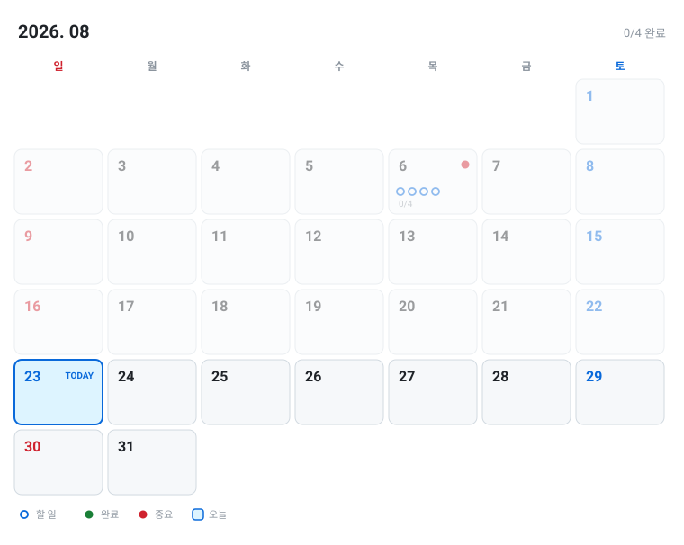

# 📅 2026-08

[🏠 홈](../README.md) | [📆 2026 연간](2026.md)

---

<picture>
  <source media="(prefers-color-scheme: dark)" srcset="../assets/calendar-2026-08-dark.svg">
  
</picture>

**📌 날짜를 클릭하면 그 날 세부 계획으로 이동해요.**

| 일 | 월 | 화 | 수 | 목 | 금 | 토 |
|:---:|:---:|:---:|:---:|:---:|:---:|:---:|
|   |   |   |   |   |   | 1 |
| 2 | 3 | 4 | [5](#d0805) | [**6**](#d0806) | [7](#d0807) | 8 |
| 9 | [10](#d0810) | 11 | 12 | 13 | [14](#d0814) | 15 |
| 16 | 17 | 18 | 19 | 20 | 21 | 22 |
| 23 | 24 | 25 | 26 | 27 | 28 | 29 |
| 30 | 31 |   |   |   |   |   |

## 🎯 이번 달 목표

`███████░░░░░░░░░░░░░░░` **1/3** (33%)

- [ ] OverTimeKK 백엔드 API 완성
- [ ] 알고리즘 30문제 풀기
- [x] 개발 환경 세팅

## 📖 8월 전체 계획

#### 08/05 (수)

- [x] 프로젝트 구조 잡기
- [x] Postman 컬렉션 정리

#### 08/06 (목) ← **오늘**

- `09:00` **🔴 간단한 데일리 스크럼 진행 및 현재 진행상황 공유**
- `10:00` **🔴 8월2주차 깃에 이슈 설정 및 현재 어디까지 진행되었고 어디까지 할 수 있는지 목표 설정**
- [ ] `11:00` fix: 이메일 인증코드 요청/확인에 rate limit 적용 #152
- [ ] `12:00` 요셉님 진행 상황 여부 - feat: 취소표 대기 매칭 알림 - 이메일 발송 API (user-service) #118
- `13:00` **🔴 그대로 진행 및 상황보고, 자기소개서 및 기업 스크립트**
- `14:00` **🔴 현재 내 상황 숙지 및 앞으로 미래 방향성 설정**
- [ ] `15:00` feat: 취소표 대기 매칭 알림 - 이메일 발송 API (user-service) 구현, 배포까지 된다면 실제 이메일 연동해서 테스트
- `16:00` **🔴 코드 공부 및 멘토링 준비**
- `20:00` **🔴 귀가**
- `21:00` **🔴 멘토링 진행**
- [ ] `22:30` sql 공부 및 스프링 부트 공부
- `24:00` **🔴 일기 및 오늘 공부 내용 정리 (tistory나 깃에 올리기)**
- `01:00` **🔴 내일 할 것들 정리 및 취침 준비**

#### 08/07 (금)

- [ ] 통합 테스트 작성
- [ ] API 문서화

#### 08/10 (월)

- **🔴 중간 발표 자료 준비**

#### 08/14 (금)

- **🔴 스프린트 마감**

---

[🏠 홈](../README.md) | [📆 2026 연간](2026.md)

수정은 <a href="../plans/2026-08.md">plans/2026-08.md</a> 에서 하세요.
