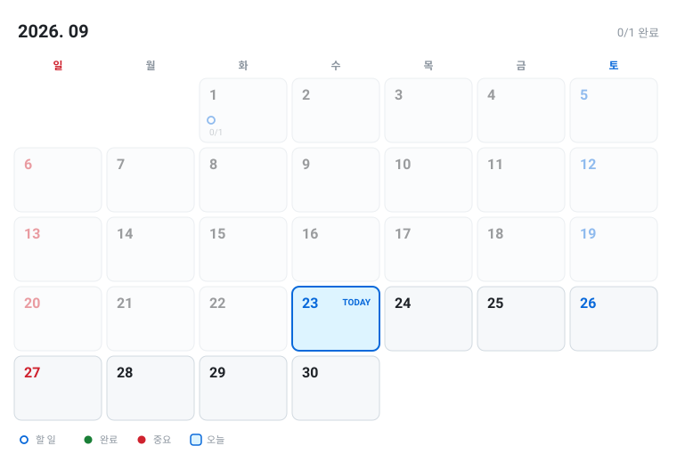

# 📅 2026-09

[◀ 2026-08](2026-08.md) | [🏠 홈](../README.md) | [📆 2026 연간](2026.md)

---

<picture>
  <source media="(prefers-color-scheme: dark)" srcset="../assets/calendar-2026-09-dark.svg">
  
</picture>

**📌 날짜를 클릭하면 그 날 세부 계획으로 이동해요.**

| 일 | 월 | 화 | 수 | 목 | 금 | 토 |
|:---:|:---:|:---:|:---:|:---:|:---:|:---:|
|   |   | [1](#d0901) | 2 | 3 | 4 | 5 |
| 6 | 7 | 🔵**8** | 9 | 10 | 11 | 12 |
| 13 | 14 | 15 | 16 | 17 | 18 | 19 |
| 20 | 21 | 22 | 23 | 24 | 25 | 26 |
| 27 | 28 | 29 | 30 |   |   |   |

## 🎯 이번 달 목표

`░░░░░░░░░░░░░░░░░░░░░░` **0/1** (0%)

- [ ] 목표를 적어보세요

## 📖 9월 전체 계획

#### 09/01 (화)

- [ ] 오늘 할 일

---

[◀ 2026-08](2026-08.md) | [🏠 홈](../README.md) | [📆 2026 연간](2026.md)

수정은 <a href="../plans/2026-09.md">plans/2026-09.md</a> 에서 하세요.
