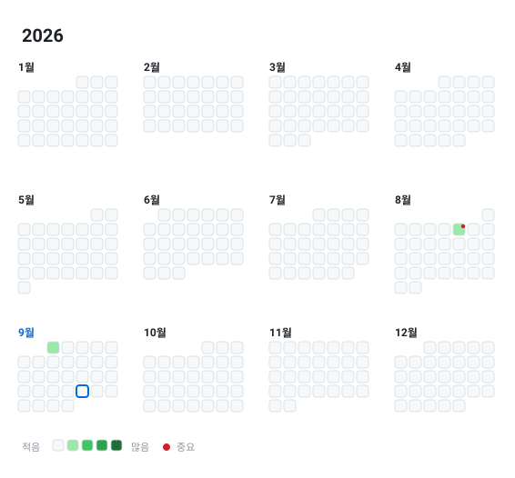

# 📆 2026년 아카이브

[🏠 홈](../README.md)

---

<picture>
  <source media="(prefers-color-scheme: dark)" srcset="../assets/year-2026-dark.svg">
  
</picture>

| 월 | 목표 진행률 | 링크 |
| :---: | --- | :---: |
| 1월 | — | — |
| 2월 | — | — |
| 3월 | — | — |
| 4월 | — | — |
| 5월 | — | — |
| 6월 | — | — |
| 7월 | — | — |
| 8월 | `███████░░░░░░░░░░░░░░░` **1/3** (33%) | [보기](2026-08.md) |
| 9월 | `░░░░░░░░░░░░░░░░░░░░░░` **0/1** (0%) | [보기](2026-09.md) |
| 10월 | — | — |
| 11월 | — | — |
| 12월 | — | — |

[🏠 홈](../README.md)
